# RSLatte 插件用户手册

本手册对应 **RSLatte 首次对外公开发布版本**：仅描述当前版本已提供的模块、侧栏与命令；能力与文案以你安装的版本为准。

## 目录

1. [简介](#简介)
2. [快速开始](#快速开始)（内含 **如何选择并执行命令**）
3. [初始化插件环境（首次使用）](#初始化插件环境首次使用)
4. [核心概念](#核心概念)
5. [工作流（推荐入口）](#工作流推荐入口)
6. [功能模块](#功能模块)
7. [设置配置](#设置配置)
8. [使用技巧](#使用技巧)
9. [常见问题](#常见问题)
10. [特性详解](特性详解/README.md)（分模块深度说明，在 `docs/特性详解/`）

**截图**：文中 **〔截图 00〕～〔截图 17〕** 等为配图预留位；图片建议放在 `docs/manual-screenshots/`，清单与替换说明见 [manual-screenshots/README.md](manual-screenshots/README.md)。

---

## 简介

RSLatte 是一个 Obsidian 插件，用于在笔记库中管理任务、项目、输出、财务、打卡、健康、联系人、提醒与日程等，并提供可选的后端同步、索引与归档能力。

### 主要特性

下列条目与 **[特性详解索引](特性详解/README.md)** 中的文档一一对应（顺序一致）；本处为总览，深度说明见各篇 `.md`。

- 🏠 **工作台（Hub）**：空间卡片、工作流条、空间切换（[工作台（Hub）](特性详解/工作台-Hub.md)）
- ✍️ **快速记录（Capture）**：一条输入写入日记 / 待整理任务等（[快速记录-Capture](特性详解/快速记录-Capture.md)）
- 🌤 **今天（Today）**：今日执行聚合页（[今天-Today](特性详解/今天-Today.md)）
- 🔁 **回顾（Review）**：周月回顾、迁移与摘要等入口（[回顾-Review](特性详解/回顾-Review.md)）
- 📒 **今日打卡侧栏**：当日打卡、财务分类、健康等快捷操作；命令面板为「打开侧边栏：今日打卡」（[今日打卡侧栏](特性详解/今日打卡侧栏.md)）
- 📋 **任务管理**：任务追踪、状态、标签与归档；侧栏内可切换 **提醒** 等页签（[任务与提醒](特性详解/任务与提醒.md)）
- 📅 **日程日历**：独立侧栏视图，浏览与管理日程（[日程日历](特性详解/日程日历.md)）
- 📁 **项目管理**：项目、里程碑、项目任务清单与进度管理（含进度图等，以当前界面为准）（[项目管理](特性详解/项目管理.md)）
- 📄 **输出管理**：按模板创建输出、状态流转、归档；**发布到知识库**、历史发布清单与台账（[输出管理](特性详解/输出管理.md)）
- 📚 **知识库阅览**：工作区或侧栏 **知识** 视图（随便看看 / 知识库概览 / 知识库清单）（[知识库阅览](特性详解/知识库阅览.md)）
- ✅ **打卡管理**：打卡项、热力图与统计（[打卡管理](特性详解/打卡管理.md)）
- 💰 **财务管理**：收支流水、分类统计与侧栏清单/统计明细（[财务管理](特性详解/财务管理.md)）
- ❤️ **健康管理**：健康数据清单与统计明细（可在设置中关闭模块）（[健康管理](特性详解/健康管理.md)）
- 👥 **联系人管理**：联系人、互动记录与生日相关能力；与任务/项目任务联动（[联系人管理](特性详解/联系人管理.md)）
- 📈 **操作日志**：侧栏工作事件时间轴（[操作日志](特性详解/操作日志.md)）
- 🔄 **同步与归档**：配置 API 后的数据库同步（按模块与设置门控）、以及按阈值的 **自动归档**（[同步与归档](特性详解/同步与归档.md)）
- 🗂️ **空间与索引**：多空间、中央索引目录、初始化门控（[空间与索引](特性详解/空间与索引.md)）

各特性的**命令 ID、视图类型与模块关系**等补充说明亦集中见于 **[特性详解](特性详解/README.md)**（`docs/特性详解/`）。

---

## 快速开始

### 安装插件

1. 打开 Obsidian **设置** → **第三方插件**
2. **浏览** 或 **从文件安装** RSLatte
3. 启用插件

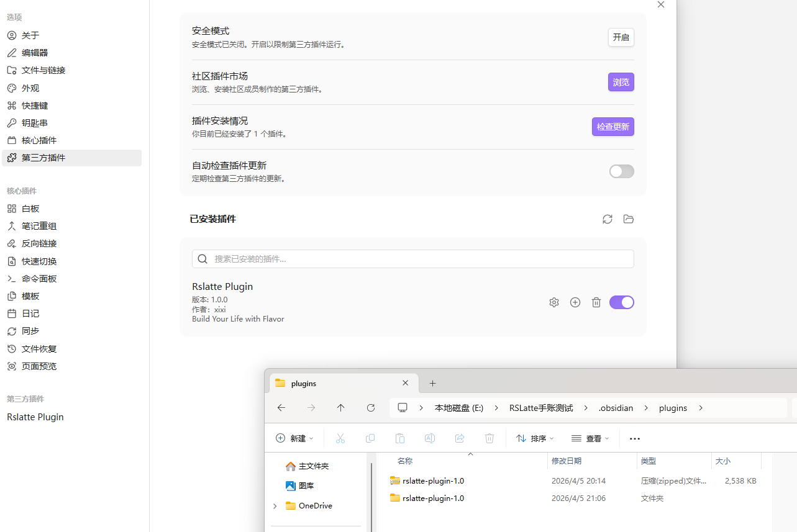
> **〔截图 00〕**：Obsidian「第三方插件」设置页，RSLatte 已安装并开启开关。
### 接下来做什么？

**首次使用请务必阅读下一章 [初始化插件环境（首次使用）](#初始化插件环境首次使用)**，**先做「插件初始化环境检查」并「完成初始化」**，再配置空间、模块与侧栏。  
下列仅为最简提醒：

- 需要云端同步时：在设置中配置 **API 基础地址** 与 **Vault ID**，并在各模块中按需开启同步。
- 中央索引目录默认在库内约定路径下（见设置中的空间/索引相关项），一般可先保留默认再按需调整。

### 如何选择并执行命令（不熟悉 Obsidian 时）

手册里出现的 **「打开侧边栏：RSLatte工作台」**、**「载入 RSLatte 内置工作区布局」**、**「打开 RSLatte 设置」** 等，都是 Obsidian 的 **命令**。可按下面任一方式执行（不必记英文命令 ID）。

**方法一：命令面板（推荐）**

1. 打开 **命令面板**  
   - **Windows / Linux**：`Ctrl + P`  
   - **macOS**：`Cmd + P`  
   若无效，打开 **Obsidian 设置 → 快捷键**，搜索 **「命令面板：在命令面板中打开」**（或类似名称），查看或改成你习惯的快捷键。
2. 在顶部输入框里输入 **关键字**（不必输入整句），例如：`Rslatte`、`工作台`、`今日打卡`、`载入`、`设置`。列表会实时过滤。
3. 用 **鼠标点击** 目标条目，或 **方向键** 选中后按 **Enter**，即可执行。  
4. **小技巧**：先输入 **`RSLatte`**（大小写不敏感），再输入空格加第二个词，可快速列出本插件相关命令，便于逐个尝试「打开侧边栏：…」类条目。

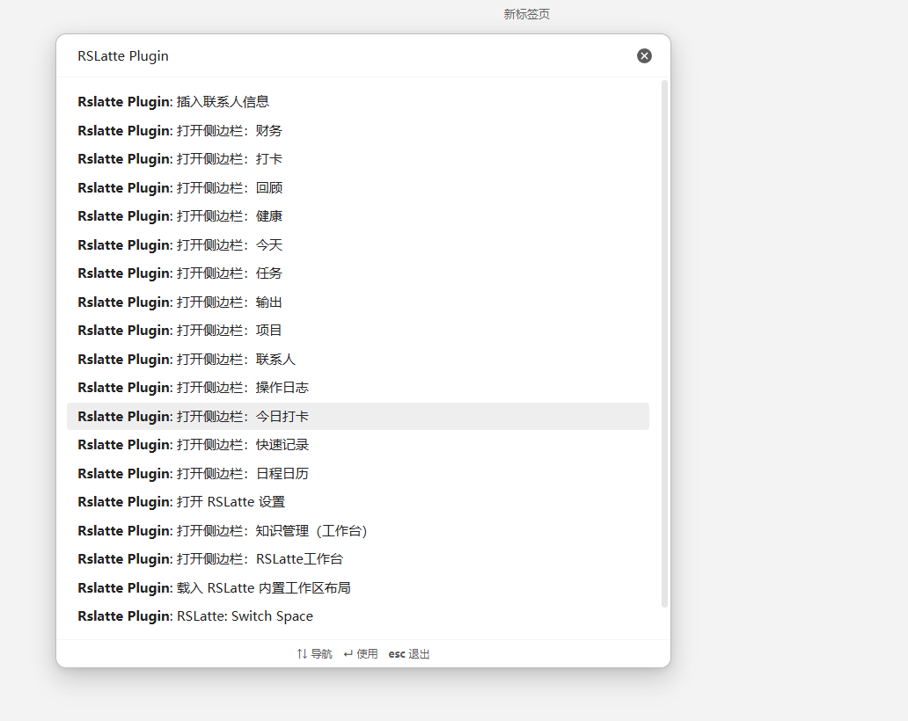
> **〔截图 01〕**：命令面板已打开，搜索 `RSLatte`，列表中出现多条「打开侧边栏：…」等命令。
**方法二：左侧功能区图标（鼠标）**

Obsidian 窗口 **最左侧竖条** 为 **功能区（Ribbon）**。RSLatte 会注册若干图标（例如 **打开 RSLatte 工作台**、**切换空间** 等），**单击图标** 即可打开对应视图，效果与命令面板中同名命令一致（以当前版本为准）。

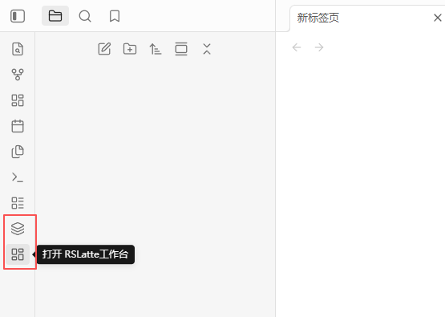
> **〔截图 02〕**：左侧功能区中 RSLatte 相关图标（工作台、切换空间等），可用箭头标注。
**方法三：为常用命令绑定快捷键**

打开 **Obsidian 设置 → 快捷键**，在搜索框输入 **`RSLatte`**，在列表中为 **「打开侧边栏：RSLatte工作台」**、**「打开侧边栏：今日打卡」** 等指定组合键，之后一键即可打开，无需每次打开命令面板搜索。

---

## 初始化插件环境（首次使用）

> 本章描述 **第一次启用插件后** 建议完成的操作顺序。**未完成「插件初始化环境检查」并点击「完成初始化（启用模块）」前，业务模块不会按设置启用**（与设置页「模块管理」门禁一致）。具体文案与按钮以当前版本 **设置 → RSLatte → 全局配置** 为准。

### 第一步：插件初始化环境检查（必做）

1. 用 **命令面板** 执行 **「打开 RSLatte 设置」**（`rslatte-open-settings`）。若不会打开命令面板，请先阅读上文 [如何选择并执行命令](#how-to-run-commands)。
2. 进入 **设置 → RSLatte → 全局配置**，打开 **「插件初始化环境检查」**（弹窗标题同名字）。
3. 按弹窗说明逐项处理，典型顺序为：
   - **Obsidian 环境与建议**：含 **「文件与链接」** 等强制项；环境检查内可跳转对应设置页。无法自动读取时，按提示勾选 **人工确认** 并 **重新检测**。
   - **建议启用核心插件「工作区」**：便于保存/切换布局，与下文 **第六步：一键载入 RSLatte 工作区布局** 配合（若暂未启用，可在 Obsidian **设置 → 核心插件** 中打开 **「工作区」**）。
   - **目录**：缺失时使用 **「一键创建全部缺失目录（含知识库二级）」** 或单行修复；改完磁盘后务必 **「重新检测」**。
   - **模板**：目录通过后再 **「一键创建全部缺失模板」**；未通过时模板按钮会置灰。
   - **推荐社区插件**：仅为建议，不阻塞完成初始化。
4. 当 **Obsidian 强制项、全部目录与模板强制项** 均通过后，点击 **「完成初始化（启用模块）」** 保存。  
5. 若之后修改了强制相关配置或目录，插件可能再次提示环境未满足，需在 **插件初始化环境检查** 中 **重新检测** 并视情况再次完成流程。

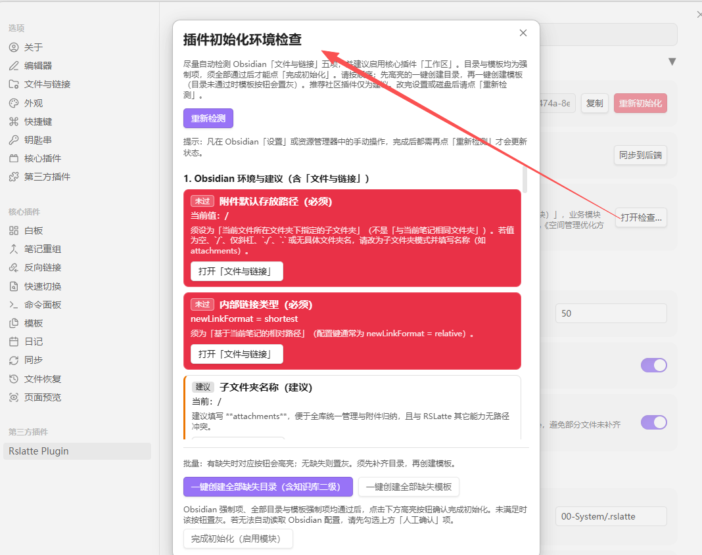
> **〔截图 03〕**：**插件初始化环境检查** 弹窗全貌（含分组检测项、一键创建目录/模板、底部「完成初始化」按钮等）。
### 第二步：打开设置并浏览「空间」

1. 仍在 **RSLatte 设置** 中确认 **当前空间** 与 **空间列表**（完成第一步后模块才按开关生效）。  
2. 若使用 **V2 目录约定**（如 `10-Personal`、`30-Knowledge` 等），在空间相关设置中核对根路径是否与你的库结构一致；与环境检查中的目录项应一致或兼容。

### 第三步：核对中央索引与日记路径

1. 在设置中找到 **中央索引目录**（或各空间索引目录）说明项，确认将写入 `.rslatte` 等索引的根位置是否符合预期（默认依赖空间配置，**勿**与 Obsidian 系统文件夹冲突）。
2. 核对 **日记目录**、**日记文件名格式**：任务/提醒/部分记录依赖日记路径；错误会导致无法写入或扫描不到。

### 第四步：按需启用模块（`moduleEnabledV2`）

**须在完成第一步之后**，在 **模块管理**（或等价入口）中按实际需要打开或关闭子模块，例如：

- **任务 / 提醒 / 日程 / 项目 / 输出 / 联系人** 等：按你的工作流开启。
- **财务 / 打卡**：记录类常用。
- **健康**：若暂不使用，可关闭以减少侧栏与索引负担。
- **publish（知识管线相关开关）**：与知识库索引、输出发布链路相关，具体以设置页文案为准。

修改后如侧栏提示「模块未启动」，属于预期行为。

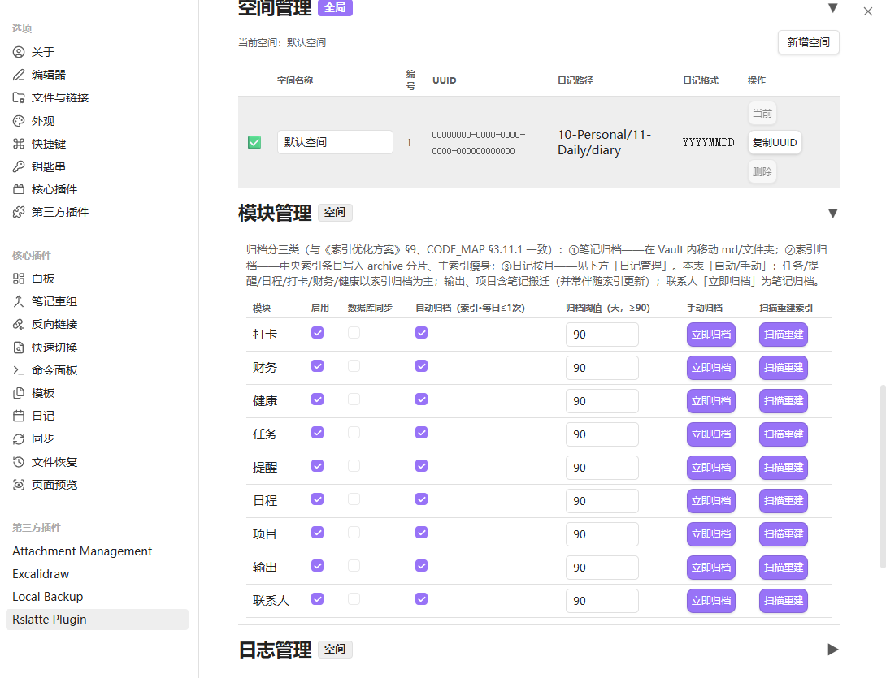
> **〔截图 04〕**：RSLatte 设置中的 **模块管理**（或模块开关列表），展示各模块启用状态。
### 第五步：（可选）配置 API 与同步

1. 仅当需要 **后端数据库同步** 时填写 **API 基础地址**（需为有效 `http(s)://` URL）。
2. 在各模块子设置中分别开启 **数据库同步**；未配置合法 API 时同步不会生效。

### 第六步：（推荐）启用「工作区」并一键载入 RSLatte 布局（在熟悉入口之前）

在点击 Hub、逐个打开侧栏 **之前**，可先搭好 Obsidian 窗口布局，减少来回拖拽：

1. 确认已启用 Obsidian **核心插件「工作区」**（**设置 → 核心插件 → 工作区**）。环境检查中也会建议开启；若当时未开，此处打开即可。  
2. 用 **命令面板**（[如何选择并执行命令](#how-to-run-commands)）执行 **「载入 RSLatte 内置工作区布局」**（`rslatte-load-bundled-workspace`）：按插件内置方案在左右侧栏等工作区中放置常用 RSLatte 视图（具体叶布局随版本可能调整）。  
3. 载入后可在 **工作区** 核心插件菜单中将当前布局 **另存为** 自己的工作区名称，便于日后一键恢复。  
4. 若需清空左右侧栏且不自动载入四象限：**「清空左右侧栏（关闭侧栏内所有视图，不载入四象限）」**（`rslatte-clear-left-right-sidebars`）。

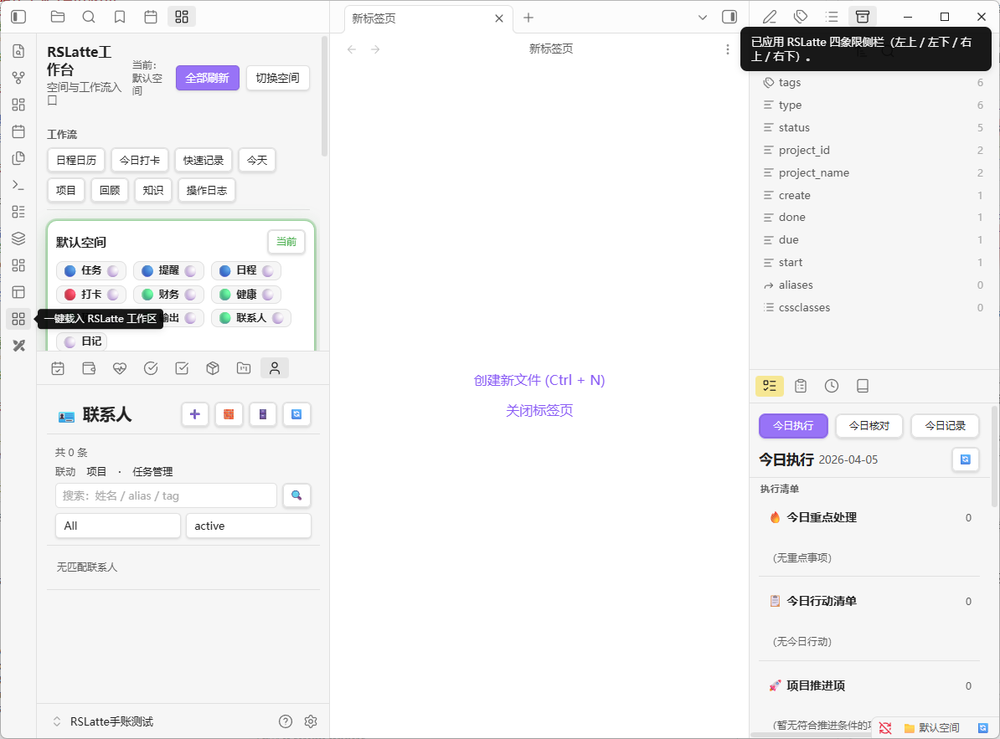
> **〔截图 05〕**：执行 **载入 RSLatte 内置工作区布局** 后的 Obsidian 窗口（主编辑区 + 左右侧栏中已出现的 RSLatte 视图）。
### 第七步：熟悉入口——RSLatte 工作台与命令

1. **任选其一**：用鼠标单击左侧功能区 **「打开 RSLatte工作台」** 图标（仪表盘样式），或在 **命令面板** 中搜索并执行 **「打开侧边栏：RSLatte工作台」**（`rslatte-hub-open`）。命令面板用法见 [如何选择并执行命令](#how-to-run-commands)。
2. 在 Hub 顶部 **工作流** 区域依次了解：
   - **快速记录** → Capture  
   - **今天** → Today  
   - **项目** → 项目管理侧栏  
   - **回顾** → Review  
   - **知识** → 知识视图（工作区）  
   - **操作日志** → 操作日志侧栏

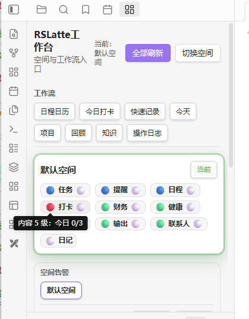
> **〔截图 06〕**：**RSLatte 工作台（Hub）** 全页：顶部工作流按钮 + 下方空间卡片区域。
### 第八步：打开「今日打卡」侧栏

1. 在 **命令面板** 中执行 **「打开侧边栏：今日打卡」**（`rslatte-open-sidepanel`）；操作方式见 [如何选择并执行命令](#how-to-run-commands)。  
2. 在此侧栏可集中使用 **打卡、财务、健康** 等与「今日」相关的快捷入口（具体页签随版本与模块开关变化）。

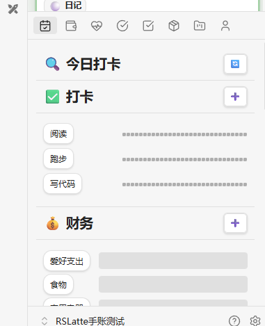
> **〔截图 07〕**：**今日打卡** 侧栏打开状态（可见打卡 / 财务 / 健康等相关分区或页签）。
### 第九步：首次建立索引（刷新 / 重建）

1. 对会写入索引的模块（任务、项目、输出、打卡、财务等），打开对应侧栏后使用顶栏 **刷新**；若说明中提供 **重建索引**，仅在需要全量重扫时使用（耗时更长）。  
2. 首次使用建议在完成日记与目录配置后，对 **已启用模块** 各执行一次刷新，确保列表非空或错误提示可理解。

### 第十步：将常用命令固定到快捷键或功能区

在 Obsidian **设置 → 快捷键** 中搜索 **`RSLatte`**，为 **「打开侧边栏：RSLatte工作台」**、**「打开侧边栏：今日打卡」**、**「打开侧边栏：任务」**、**「载入 RSLatte 内置工作区布局」** 等绑定快捷键；具体如何找到这些条目，与 [如何选择并执行命令](#how-to-run-commands) 中「方法三」一致。

---

## 核心概念

### 空间（Space）

- 每个空间有独立配置与索引目录；通过 **RSLatte 工作台** 或状态栏/命令 **切换空间**。

### 模块（Module）

插件为 **可开关模块** 组合（在设置中启用/禁用），主要包括：

| 能力 | 说明 |
|------|------|
| 任务 | 任务清单索引、任务侧栏（含 **提醒** 等页签） |
| 提醒 | 与任务共用日记与索引体系，入口在任务侧栏 |
| 日程 | 日程索引与 **日程日历** 侧栏 |
| 项目 | 项目与项目任务清单 |
| 输出 | 输出文档与模板；**发布到知识库** |
| 财务 / 打卡 / 健康 | 记录类侧栏与 Pipeline |
| 联系人 | 联系人侧栏与互动索引 |
| 知识索引 | 中央 `knowledge-index.json` 等，由输出发布、管线与阅览视图协同维护 |

### 索引（Index）

- 各模块在约定目录下维护 `*-index.json` 等文件；支持手动刷新与部分模块的重建。  
- **勿**手动随意删除正在使用的索引文件，除非你知道如何触发全量重建。

### 同步（Sync）

- 配置合法 API 后，可按模块开启数据库同步；失败时侧栏或状态区可能有提示，以控制台与设置为准。

---

## 工作流（推荐入口）

以 **RSLatte 工作台（Hub）** 为枢纽：顶部工作流为 **快速记录 → 今天 → 项目 → 回顾 → 知识 → 操作日志**。下方为 **各空间卡片**（状态灯、告警摘要、点击进入对应能力）。

### 与工作台、今日打卡的关系

| 入口 | 定位 |
|------|------|
| **RSLatte 工作台** | 空间切换 + 工作流按钮 + 空间卡片 |
| **今天（Today）** | 今日执行聚合页（任务今日、记录入口等） |
| **今日打卡** | 侧栏：当日打卡 / 财务 / 健康等快捷操作 |

需要 **全局总览与跳转** 时用 **RSLatte 工作台**；需要 **按日执行清单** 用 **今天**；需要 **快速打勾记账** 用 **今日打卡**。

### Capture（快速记录）

- 一条输入框写入；可选 **保存为今日任务** 或 **待整理** 到当日日记。

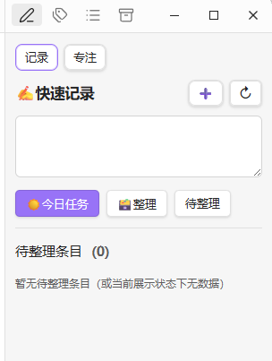
> **〔截图 15〕**：**快速记录（Capture）** 视图主界面。
### Today（今天）

- 展示今日相关任务与记录入口；若启用打卡，可有完成度摘要。

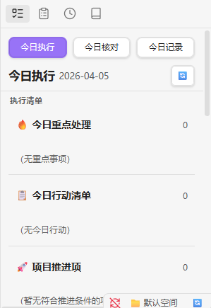
> **〔截图 16〕**：**今天（Today）** 视图主界面。
### Review（回顾）

- 未完成任务迁移、习惯/打卡与知识/输出摘要、周月回顾入口等（以当前侧栏为准）。

### 知识（Knowledge）

- 工作区或侧栏打开 **知识** 视图：浏览知识库与输出沉淀；**发布**请通过 **输出侧栏** 的 **发布到知识库** 完成。

### 操作日志

- 侧栏按时间与条件查看工作事件，可跳转到相关侧栏。

---

## 功能模块

下文 **「打开侧边栏：…」** 均指在 **命令面板** 中搜索并执行对应命令；操作步骤见 [如何选择并执行命令](#how-to-run-commands)。

**工作流页面**（快速记录、今天、回顾、知识视图、操作日志等）以 **RSLatte 工作台** 顶栏为主入口，说明见上一章 [工作流（推荐入口）](#工作流推荐入口)；与 [特性详解索引](特性详解/README.md) 中 [快速记录-Capture](特性详解/快速记录-Capture.md)、[今天-Today](特性详解/今天-Today.md)、[回顾-Review](特性详解/回顾-Review.md)、[知识库阅览](特性详解/知识库阅览.md)、[操作日志](特性详解/操作日志.md) 对应。下列编号侧重 **侧栏业务模块** 与 **Hub**。

### 1. 任务管理（含提醒）

- **打开侧边栏：任务**（`rslatte-open-taskpanel`）。
- 在侧栏内切换 **提醒** 等页签管理备忘；与任务共用日记写入规则。
- 支持列表、状态、标签、归档等（详见侧栏内按钮与设置）。

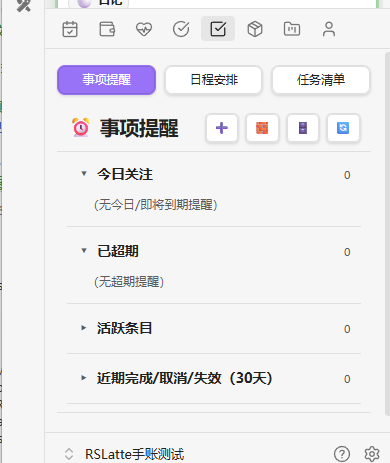
> **〔截图 08〕**：**任务** 侧栏（含列表与「提醒」等页签切换可见）。
### 2. 日程日历

- **打开侧边栏：日程日历**（`rslatte-open-calendar`）。
- 与任务侧栏中的日程能力互补；以日历形态浏览日程条目。

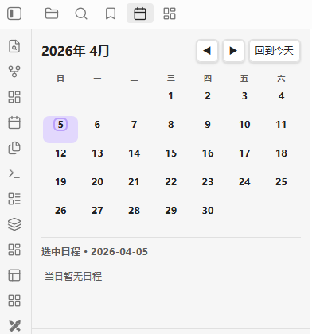
> **〔截图 09〕**：**日程日历** 侧栏主界面。
### 3. 项目管理

- **打开侧边栏：项目**（`rslatte-open-project-panel`）。
- 里程碑、项目任务清单、进度管理页签；**项目进度图** 等区域以当前版本侧栏为准。

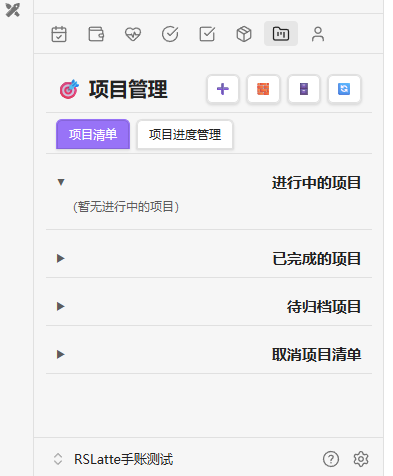
> **〔截图 17〕**：**项目** 侧栏（项目列表或进度管理页签界面）。
### 4. 输出管理

- **打开侧边栏：输出**（`rslatte-open-output-panel`）。
- 模板创建、状态按钮、等待/恢复、**发布到知识库**（移动/复制至 `30-Knowledge` 下约定目录）。
- 输出内 **历史发布清单** 子页签：检索已发布记录、打回草稿等（以当前侧栏为准）。

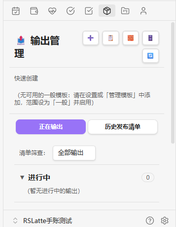
> **〔截图 10〕**：**输出** 侧栏中创建/列表界面 + **发布到知识库** 弹窗或入口（可拆成两张图时，第二张命名为 `10b-publish-to-knowledge-modal.png`）。
### 5. 知识库阅览

- **打开侧边栏：知识管理（工作台）**（命令 ID：`rslatte-open-publish-panel`）：在工作区打开 **知识** 视图（与 Hub 工作流「知识」一致）。
- **知识库阅览侧栏**可与工作区中的知识视图并存（同一套界面、不同视图类型），通常通过 **载入 RSLatte 内置工作区布局** 或自行排列工作区获得。

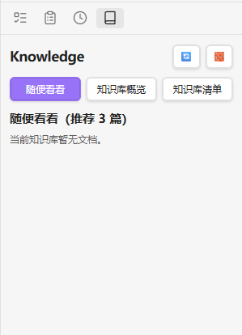
> **〔截图 11〕**：**知识** 视图（工作区或侧栏），建议包含页签「随便看看 / 知识库概览 / 知识库清单」之一屏。
### 6. 打卡管理

- **打开侧边栏：打卡**（`rslatte-open-checkin-panel`）。
- 热力图、按项打卡、统计与归档（见设置）。

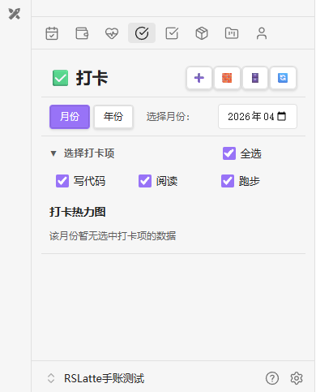
> **〔截图 12〕**：**打卡** 侧栏（热力图 + 列表区域）。
### 7. 财务管理

- **打开侧边栏：财务**（`rslatte-open-finance-panel`）。
- 分类按钮、流水清单、统计明细与异常清单等（随版本迭代）。

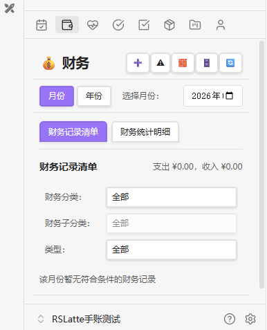
> **〔截图 13〕**：**财务** 侧栏（清单或统计明细页签其一，可二选一或拼图）。
### 8. 健康管理

- **打开侧边栏：健康**（`rslatte-open-health-panel`）。
- 清单 / 统计页签、录入与 Pipeline 衍生分析（默认启用时；可在设置关闭模块）。

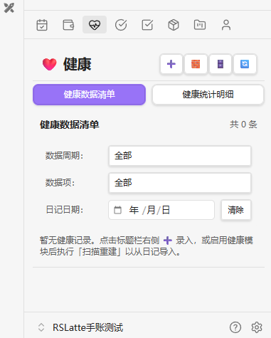
> **〔截图 14〕**：**健康** 侧栏（清单或统计页签）。
### 9. 联系人管理

- **打开侧边栏：联系人**（`rslatte-open-contacts-panel`）。
- 新增/编辑联系人、互动记录、与任务/项目任务联动。
- 默认分组、目录黑名单等可在 **联系人相关设置** 中配置；新建与保存联系人时由插件按约定生成或维护笔记结构（详见设置说明）。

### 10. 操作日志

- **打开侧边栏：操作日志**（`rslatte-open-timeline`）。
- 按时间与条件筛选工作事件；可跳转到相关侧栏。

### 11. RSLatte 工作台（Hub）

- **打开侧边栏：RSLatte工作台**（`rslatte-hub-open`）。
- 空间卡片 + 工作流快捷方式；状态栏可显示当前空间并支持切换。

### 12. 空间与索引

- **多空间**：当前空间、各空间路径与 V2 根目录等在 **设置 → RSLatte** 中维护；切换空间后索引与侧栏数据随当前空间快照变化。
- **中央索引**：各模块 `*-index.json` 等默认位于库内约定目录（随空间配置）；**勿**随意删除正在使用的索引文件，除非你知道如何触发全量重建。
- **初始化门控**：未完成「插件初始化环境检查」并 **完成初始化** 前，业务模块不按设置启用（与 [初始化插件环境](#初始化插件环境首次使用) 一致）。
- 详见 [空间与索引](特性详解/空间与索引.md)。

### 13. 同步与归档

- **同步**：配置合法 **API 基础地址** 与 **Vault ID** 后，可按模块开启与后端数据库同步；失败时侧栏或状态区可能有提示。
- **归档**：各模块 **自动归档** 阈值与开关在设置中维护；部分侧栏提供与归档相关的 Pipeline 操作（以当前版本为准）。
- 详见 [同步与归档](特性详解/同步与归档.md)。

---

## 设置配置

### 基础设置

- **API 基础地址**、**Vault ID**：仅同步需要时填写。  
- **空间**：当前空间、空间列表、各空间路径与 V2 根目录等。  
- **中央索引目录**：随空间配置；勿随意指向只读位置。

### 模块设置

各模块在设置中有独立区块（任务、提醒、日程、项目、输出、财务、打卡、健康、联系人、知识相关等）。**发布到知识库**的路径、知识库二级目录等与 **输出 / 知识管理** 相关设置一并维护。

### 日记与归档

- 日记目录、文件名格式、各模块日志追加规则（H1/H2）。  
- 各模块 **自动归档** 阈值与开关。

### 工作事件与自动刷新

- **工作事件** 开关与路径。  
- **自动刷新索引** 间隔（若开启）。

---

## 使用技巧

1. **首次环境**：先完成 **插件初始化环境检查** 与 **完成初始化**；需要多窗布局时，启用核心插件 **「工作区」** 后，用 [命令面板](#how-to-run-commands) 执行 **载入 RSLatte 内置工作区布局**，再熟悉 Hub。  
2. **先开工作台**：不确定入口时，先打开 **RSLatte 工作台**，再用工作流按钮跳转。  
3. **今日打卡**：把 **打开侧边栏：今日打卡** 绑快捷键，适合每日固定动作。  
4. **发布到知识库**：在 **输出侧栏** 对条目使用发布流程，再到 **知识** 视图浏览沉淀。  
5. **勿混淆名称**：命令面板中 **「今日打卡」** 即侧栏 `rslatte-sidepanel`；与 **「今天」**（Today 视图）不同。  
6. **索引异常**：优先使用各侧栏 **刷新**；再考虑设置中的重建说明。  
7. **URI 跳转**：笔记中可使用 `obsidian://rslatte-open?module=…` 等形式打开模块（详见 `docs/SIDEBAR_SHORTCUTS.md`）。

---

## 常见问题

### Q1: 「打开侧边栏：RSLatte工作台」打开的是什么？

A: **RSLatte 工作台（Hub）**：用于切换空间、使用顶部工作流按钮（快速记录、今天、项目等）以及查看各空间卡片概览。

### Q2: 在命令面板里搜不到 RSLatte 命令怎么办？

A: 确认 **第三方插件** 中 RSLatte **已启用**；命令面板用 **`Ctrl/Cmd + P`** 打开后，先输入 **`RSLatte`** 再浏览列表。若仍没有，重启 Obsidian 后再试。完整步骤见 [如何选择并执行命令](#how-to-run-commands)。

### Q3: 为什么「模块管理」开关是灰的或业务侧栏不工作？

A: 须先在 **设置 → RSLatte → 全局配置 → 插件初始化环境检查** 中让所有 **强制项** 通过，并点击 **「完成初始化（启用模块）」**。未完成前，模块不会按开关启用；若之后改了「文件与链接」、必选目录或模板，需回到该检查中 **重新检测** 并视情况再次完成。

### Q4: 如何把文档发布到知识库并在知识视图中看到？

A: 在 **输出管理** 侧栏对条目使用 **发布到知识库**（移动或复制到 `30-Knowledge` 下约定目录），然后在 **知识** 视图（工作区或侧栏）中浏览与检索。

### Q5: 如何备份与迁移？

A: 备份整个 Obsidian 库即可（含索引目录与笔记）。新设备上安装插件后，保持相对路径与空间配置一致；需要同步时配置相同 API 与 Vault ID。

### Q6: 索引损坏怎么办？

A: 在对应模块侧栏使用 **刷新**；仍异常时在设置或文档中查找 **重建** 说明，或联系维护者。不要随意删除索引文件除非你知道如何全量重建。

### Q7: 如何禁用某个模块？

A: 在 **设置 → RSLatte** 中关闭对应模块开关；侧栏将提示未启动或隐藏入口。

### Q8: 发布记录写在哪里？

A: 以 **知识库中目标 Markdown 的 frontmatter**（如发布时间、来源输出路径等）以及 **输出台账**（`output-ledger` 等）为准。具体字段以设置页与侧栏行为说明为准。

---

## 版本说明

- 本手册与 **RSLatte 首次对外公开发布版本** 同步提供；后续版本若调整命令名或界面，以安装包内说明与 **命令面板** 为准。

---

## 技术支持

1. 查阅本文 **常见问题**、[特性详解](特性详解/README.md) 与 `docs` 下其他专题文档。  
2. 打开开发者工具查看控制台错误。  
3. 核对 **设置 → RSLatte** 与 **空间/索引** 路径。  
4. 向维护者反馈时请附带插件版本与复现步骤。

---

## 许可证

[根据实际情况填写]

---

**祝使用愉快！** 🎉

